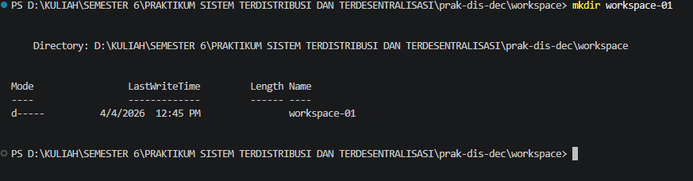
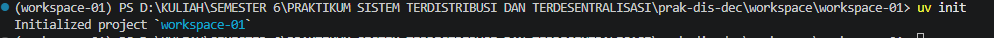

# Laporan Praktikum PRAKTIKUM SISTEM TERDISTRIBUSI DAN TERDESENTRALISASI #

---
## Minggu 2

------
Nama    : Muhammad Java Arifin

NIM     : 235410073

-----
 ## Komunikasi Antar Proses pada Sistem Terdistribusi

Pengantar

Proses merupakan hasil dari eksekusi program / aplikasi yang bersifat executable.
Proses dikelola oleh sistem operasi dan terdiri atas executable code, data, resources, serta
informasi tentang state (stack dan heap). Setiap aplikasi yang dijalankan akan menjadi
proses.

### I. Proses pada Satu Node
 Pada satu node, semua akan berada dalam kendali sistem operasi: eksekusi
 menjadi proses, alokasi resources, pengelolaan proses, serta komunikasi antar proses. Hal
 ini bersifat transparan terhadap pengguna (artinya pengguna tidak perlu melihat, tapi di latar
 belakang proses ini dikelola oleh sistem operasi)

### Tugas

### 1. Tampilkan berbagai proses yang ada pada komputer yang    anda gunakan sesuaidengan sistem operasi yang anda gunakan.
Disini saya memakai sistem oprasi windows cara untuk melihat berbagai proses di task manager bisa dengan cara tekan pada keyboard ctrl+shift+esc dengan menekan tombol itu berbarengan akan menampilkan task manager dan anda bisa melihat berbagai proses yang ada pada komputer yang anda gunakan
    

    Gambar diatas merupakan gambar task manager yang menampilkan berbagai proses pada komputer saya 

### 2. Jalankan salah satu aplikasi, perlihatkan proses yang dimunculkan oleh aplikasi tesebut.

aplikasi yang dijalankan adalah capcut editing video dan dari tampilan gambar diatas menunjukan aplikasi ini menggunakan sumber daya sistem sebagai berikut :
* CPU: sebesar 6,8%
* Memori (RAM): sebesar 1.379,2 MB (±1,3 GB)
* Disk: sebesar 2,3 MB/s
* Jaringan (Network): sebesar 2,9 Mbps

### 3. Carilah petunjuk untuk: me-restart proses dan mematikan proses. Matikan proses yang dimunculkan oleh aplikasi yang anda jalankan, jangan gunakan perintah untuk keluar dari aplikasi yang anda jalankan tetapi gunakan perintah untuk mematikan proses dari aplikasi yang anda jalankan.

Gambar diatas merupakan proses aplikasi capcut sebelum di matikan prosesnya,di sistem oprasi windows untuk mematikan proses di task manager dengan cara klik kana aplikasi yang mau di matikan prosesnya dan pilih opsi "end task" setelah di end task maka aplikasi tersebut akan mematikan prosesnya di dalam komputer berikut gambar hasil setelah dimatika porsesnya

Setelah aplikasi di end task maka akan terlihat tidak memakan sumber daya komputer

### 4. Jelaskan semua hal yang anda kerjakan tersebut.
Untuk membuka task manager di sistem oprasi windows bisa dengan short cut "ctr+shift+esc" dengan task manager saya dapat melihat berbagai komunikasi antar proses. saya mencoba membuka aplikasi CapCut editor video dan saya dapa melihat detail sumber daya yang digunakan aplikasi ini. Dan saya juga mencoba untuk mematikan proses dengan cara end task di task manager 

## II. Komunikasi Antar Proses pada Sistem Terdistribusi

###   Menggunakan Strawberry untuk GraphQL Server
Berikut langkah-langkah praktik yang bisa dikerjakan:
### 1. Pelajari cara menggunakan uv. Lihat catatan di 
    https://github.com/NEO-X-School/notes/blob/main/uv/00.md.
### 2. Buat workspace dengan nama workspace-01. Pada workspace tersebut, gunakan Python versi 3.14.3 (lihat petunjuk di atas).
- ### membuat forlder workspace dengan nama folder workspace-01
        mkdir workspace-01
        cd workspace-01
    
dari gambar diatas folder workspace-01 berhasil dibuat

- ### Memilih/menentukan Versi Python
    Untuk menentukan versi Python yang tersedia dapat dengan cara dibawah ini

        uv python list

    
      
    Memilih versi Python
      
        uv python pin cpython-3.14.3
    
  
      

### 3. Buat environment, aktifkan environment yang sudah anda     buat tersebut.
- Untuk membut enviroment dengan cara seperti berikut

        uv venv
    
    
- Mengaktifkan environment (Windows):
        
        .venv\Scripts\activate
    
    

    
### 4. Instalasi paket-paket yang diperlukan:
- Instalasi library dan cek package

    Install package
        
        uv pip install "strawberry-graphql[cli]"
    
    
    cek package
    
        uv pip list
    
    Dari gambar diatas Package Strawbery-graphql sukses di install

### 5. Membuat file schema graphQl
- Cara membuat file 
    
        notepad schema.py
    
    Isi file schema.py
    
        import typing
        import strawberry

        def get_books():
            return [
                Book(
                    title="The Great Gatsby",
                    author="F. Scott Fitzgerald",
                ),
            ]

        @strawberry.type
        class Book:
            title: str
            author: str

        @strawberry.type
        class Query:
            books: typing.List[Book] = strawberry.field(resolver=get_books)

        schema = strawberry.Schema(query=Query)

### 6.Inisialisasi Project dan Instalasi Dependency

- Inisialisasi project:

        uv init

    

- Install dependency

         uv add fastapi uvicorn strawberry-graphql
    

- Membuat file utama aplikasi:

        notepad main.py

    Isi file main.py
    
        from fastapi import FastAPI
        import strawberry
        from strawberry.fastapi import GraphQLRouter
        from schema import schema

        app = FastAPI()

        graphql_app = GraphQLRouter(schema)

        app.include_router(graphql_app, prefix="/graphql")       
    
### 7. Menjalankan graphQL server
- Menjalankan Server

         uv run uvicorn main:app

    ouput
    
    Server berhasil berjalan : Uvicorn running on http://127.0.0.1:8000

### 8. Menguji query graphQL
- Menguji query melalui browser dengan cara buka akses  http://127.0.0.1:8000/graphql

- Masukan query

    

### 9. Penjelasan Kegiatan
Praktikum ini bertujuan untuk membangun GraphQL server menggunakan Strawberry GraphQL yang diintegrasikan dengan FastAPI dan dijalankan menggunakan Uvicorn.

Langkah-langkah yang dilakukan meliputi:

- Menggunakan uv untuk mengelola versi Python dan environment.
- Membuat workspace dan menentukan versi Python agar konsisten.
- Membuat serta mengaktifkan virtual environment untuk isolasi project.
- Menginstall dependency yang dibutuhkan (Strawberry, FastAPI, Uvicorn).
- Membuat schema GraphQL yang berisi type, query, dan resolver.
- Menghubungkan schema ke FastAPI melalui endpoint /graphql.
- Menjalankan server menggunakan Uvicorn.
- Menguji query GraphQL melalui browser.

### 10.Tugas Membuat Client Sedarhana
- Install library request

        uv install requests

    

- Buat file client.py dan isi seperti dibawah

        import requests

        url = "http://127.0.0.1:8000/graphql"

        query = """
        query {
        books {
            title
            author
        }
        }
        """

        response = requests.post(url, json={"query": query})

        print(response.json())

- Pastikan masih running:

        uv run uvicorn main:app

    

- buka terminal baru dan jalankan 

        python client.py
    
    Output 
    
    Data berhasil ditampilkan

## Kesimpulan
Pada praktikum ini, saya berhasil memahami konsep komunikasi antar proses, baik dalam satu komputer maupun pada sistem terdistribusi. Pada bagian pertama, saya dapat melihat, menjalankan, dan menghentikan proses menggunakan Task Manager di Windows, sehingga memahami bagaimana sistem operasi mengelola sumber daya.

Pada bagian kedua, saya berhasil membangun server GraphQL menggunakan Strawberry GraphQL yang diintegrasikan dengan FastAPI dan dijalankan menggunakan Uvicorn. Selain itu, saya juga berhasil membuat client sederhana yang dapat mengirim request dan menerima response dari server.

Secara keseluruhan, praktikum ini membantu saya memahami bagaimana komunikasi data terjadi antara client dan server dalam sistem terdistribusi secara nyata.