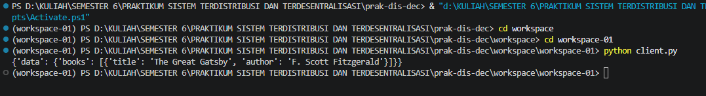

# prak-dis-dec
# Laporan Praktikum PRAKTIKUM SISTEM TERDISTRIBUSI DAN TERDESENTRALISASI #

---
## Minggu 2

------
Nama    : Muhammad Java Arifin

NIM     : 235410073

-----
 ## Komunikasi Antar Proses pada Sistem Terdistribusi

Pengantar

Proses merupakan hasil dari eksekusi program / aplikasi yang bersifat executable.
Proses dikelola oleh sistem operasi dan terdiri atas executable code, data, resources, serta
informasi tentang state (stack dan heap). Setiap aplikasi yang dijalankan akan menjadi
proses.

### 1. Proses pada Satu Node

    Pada satu node, semua akan berada dalam kendali sistem operasi: eksekusi
    menjadi proses, alokasi resources, pengelolaan proses, serta komunikasi antar proses. Hal
    ini bersifat transparan terhadap pengguna (artinya pengguna tidak perlu melihat, tapi di latar
    belakang proses ini dikelola oleh sistem operasi)

### TUGAS

### 1. Tampilkan berbagai proses yang ada pada komputer yang    anda gunakan sesuai
dengan sistem operasi yang anda gunakan.

    
    Disini saya memakai sistem oprasi windows cara untuk melihat berbagai proses di task manager bisa dengan cara tekan pada keyboard ctrl+shift+esc dengan menekan tombol itu berbarengan akan menampilkan task manager dan anda bisa melihat berbagai proses yang ada pada komputer yang anda gunakan
    

    Gambar diatas merupakan gambar task manager yang menampilkan berbagai proses pada komputer saya 

### 2. Jalankan salah satu aplikasi, perlihatkan proses yang dimunculkan oleh aplikasi tesebut.

aplikasi yang dijalankan adalah capcut editing video dan dari tampilan gambar diatas menunjukan aplikasi ini menggunakan sumber daya sistem sebagai berikut :
* CPU: sebesar 6,8%
* Memori (RAM): sebesar 1.379,2 MB (±1,3 GB)
* Disk: sebesar 2,3 MB/s
* Jaringan (Network): sebesar 2,9 Mbps