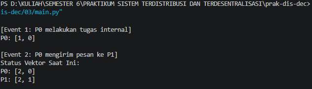
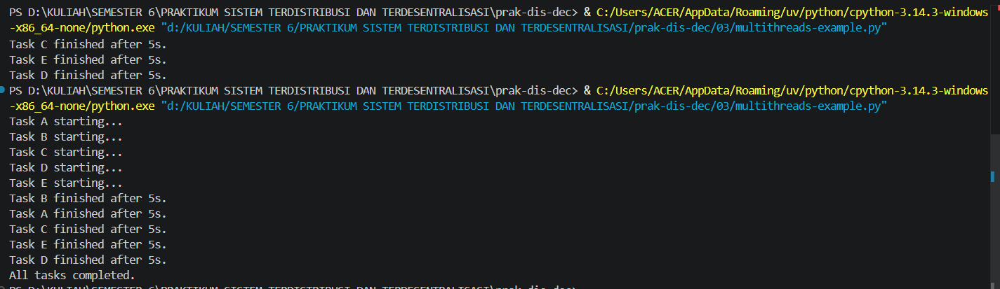
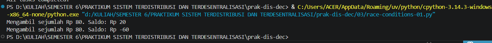
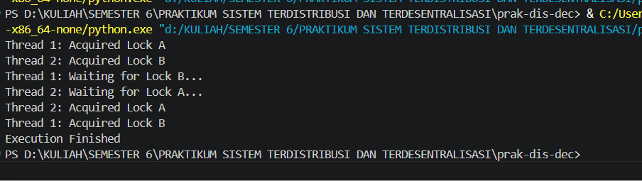

# LAPORAN PRAKTIKUM SISTEM TERDISTRIBUSI DAN TERDESENTRALISASI #

---
## Minggu 2

------
Nama    : Muhammad Java Arifin

NIM     : 235410073

-----
 ## Sinkronisasi pada Sistem Terdistribusi

 ### 1 Sinkronisasi Waktu
 1. Menginstall Net Time di windows dengan link berikut : https://www.timesynctool.com/
 
 2. setelah install Net Time lalu buka aplikasi Network Time lalu amati proses sinkronisasi

    

    Gambar diatas merupakan proses sinkronisasi beriikut rician proses sinkronisasi
    
    - Server yang digunakan nettime.pool.ntp.org dengan status koneksi (Good) yang berarti baik

    -   Waktu eksekusi atau Last Sync berhasil di eksekusi pada pukul 08:42:23

    - Offset di time komputer saya lambat 2,438 detik  dan jeda jaringan saat mengambil data lag 26ms
    
    - Next Attempt: Aplikasi ini bekerja otomatis di latar belakang (Mode: Windows Service). Untuk menjaga presisi jam secara berkala, sistem sudah menjadwalkan proses sinkronisasi berikutnya yang akan otomatis berjalan dalam 11 jam 36 menit 14 detik lagi.

### 2 Vector Clock
Vector clock digunakan untuk pengurutan event dalam suatu sistem terdistribusi. Berikut
adalah contoh source code untuk vector clock (ada pada source code: vclocks.py). Source
code diambil dari banyak sumber di Internet

    class VectorClock:
        def __init__(self, num_processes, process_id):
            self.clocks = [0] * num_processes  # Initialize all clocks to zero
            # The ID of the current process
            self.process_id = process_id

        def increment(self):
            """Increments the local clock for the current process."""
            self.clocks[self.process_id] += 1

        def send_message(self):
            """Prepares the vector clock for sending with a message."""
            self.increment()  # Increment local clock before sending
            return list(self.clocks)  # Return a copy of the current vector clock

        def receive_message(self, received_clocks):
            """Updates the vector clock upon receiving a message."""
            for i in range(len(self.clocks)):
                self.clocks[i] = max(self.clocks[i], received_clocks[i])
            self.increment()  # Increment local clock after receiving and merging

        def __str__(self):
            return f"P{self.process_id}: {self.clocks}"

        def happens_before(self, other_vector_clock):
            """
            Determines if this vector clock happens before another.
            A happens before B if all elements in A are less than or equal to
            the corresponding elements in B, and at least one element in A is
            strictly less than the corresponding element in B.
            """
            if self.clocks == other_vector_clock.clocks:
                return False  # Same clocks, not "happens before"

            all_le = True  # All elements are less than or equal
            any_lt = False  # At least one element is strictly less than

            for i in range(len(self.clocks)):
                if self.clocks[i] > other_vector_clock.clocks[i]:
                    return False  # Not "happens before" if any element is greater
                if self.clocks[i] < other_vector_clock.clocks[i]:
                    any_lt = True

            return all_le and any_lt

        def is_concurrent(self, other_vector_clock):
            """
            Determines if two vector clocks are concurrent.
            Two events are concurrent if neither happens before the other.
            """
            return not (self.happens_before(other_vector_clock) or
                        other_vector_clock.happens_before(self))

    # Simulate a system with 3 processes
    vc0 = VectorClock(num_processes=3, process_id=0)
    vc1 = VectorClock(num_processes=3, process_id=1)
    vc2 = VectorClock(num_processes=3, process_id=2)

    print(vc0)
    print(vc1)
    print(vc2)

    # Process 0 performs a local event
    vc0.increment()
    print(vc0)

    # Process 0 sends a message to Process 1
    message_from_p0 = vc0.send_message()
    vc1.receive_message(message_from_p0)
    print(vc0)
    print(vc1)

    # Process 2 performs a local event
    vc2.increment()
    print(vc2)

    # Process 1 sends a message to Process 2
    message_from_p1 = vc1.send_message()
    vc2.receive_message(message_from_p1)
    print(vc1)
    print(vc2)

    # Check causality
    print(f"vc0 happens before vc1: {vc0.happens_before(vc1)}")
    print(f"vc1 happens before vc0: {vc1.happens_before(vc0)}")
    print(f"vc0 is concurrent with vc2: {vc0.is_concurrent(vc2)}")

### Tugas
1. Jalankan program tersebut, amati keluarannya. Buat penjelasan dari keluaran
tersebut: bandingkan dengan algoritma tersebut jika vector clocks dilaksanakan
secara manual.

    setelah saya amati keluarannya program diatas berikut penjelasan saya :

    - Event Lokal: Setiap ada kejadian, proses hanya menambah nilai +1 pada indeksnya sendiri. (Contoh: P0 berubah dari [0, 0, 0] menjadi [1, 0, 0]).

    - Terima Pesan: Saat menerima pesan, sistem mengambil nilai tertinggi (max) dari setiap elemen antara vektor miliknya sendiri dan vektor dari pesan tersebut. Setelah itu, sistem menambah +1 pada indeksnya sendiri. (Contoh: P2 [0, 0, 1] menerima pesan P1 [2, 2, 0], nilai gabungan tertingginya [2, 2, 1], lalu indeks P2 ditambah 1 sehingga hasil akhirnya [2, 2, 2]).

    - Uji Kausalitas: Status happens_before terbukti True jika semua angka pada vektor pertama lebih kecil atau sama dengan vektor kedua. Dua kejadian dianggap concurrent (berjalan bersamaan) jika tidak ada yang saling mendahului. Karena vc0 mendahului vc1, dan vc1 mendahului vc2, maka vc0 tidak concurrent dengan vc2 (bernilai False).

2. Buat modul Python untuk class VectorClock tersebut dan buatlah contoh cara menggunakan modul tersebut.

     ### vclocks.py

        class VectorClock:
            def __init__(self, num_processes, process_id):
                self.clocks = [0] * num_processes # Initialize all clocks to zero
                self.process_id = process_id      # The ID of the current process

            def increment(self):
                """Increments the local clock for the current process."""
                self.clocks[self.process_id] += 1

            def send_message(self):
                """Prepares the vector clock for sending with a message."""
                self.increment() # Increment local clock before sending
                return list(self.clocks) # Return a copy of the current vector clock

            def receive_message(self, received_clocks):
                """Updates the vector clock upon receiving a message."""
                for i in range(len(self.clocks)):
                    self.clocks[i] = max(self.clocks[i], received_clocks[i])
                self.increment() # Increment local clock after receiving and merging

            def __str__(self):
                return f"P{self.process_id}: {self.clocks}"

            def happens_before(self, other_vector_clock):
                """
                Determines if this vector clock happens before another.
                A happens before B if all elements in A are less than or equal to
                the corresponding elements in B, and at least one element in A is
                strictly less than the corresponding element in B.
                """
                if self.clocks == other_vector_clock.clocks:
                    return False # Same clocks, not happens before

                all_le = True  # All elements are less than or equal
                any_lt = False # At least one element is strictly less than

                for i in range(len(self.clocks)):
                    if self.clocks[i] > other_vector_clock.clocks[i]:
                        return False # Not happens before if any element is greater
                    if self.clocks[i] < other_vector_clock.clocks[i]:
                        any_lt = True

                return all_le and any_lt

            def is_concurrent(self, other_vector_clock):
                """
                Determines if two vector clocks are concurrent.
                Two events are concurrent if neither happens before the other.
                """
                return not (self.happens_before(other_vector_clock) or
                other_vector_clock.happens_before(self))
    
    ### main.py
            # Impor kelas VectorClock dari modul vclocks yang telah dibuat
            from vclocks import VectorClock

            # Simulate a system with 3 processes 
            vc0 = VectorClock(num_processes=3, process_id=0) 
            vc1 = VectorClock(num_processes=3, process_id=1) 
            vc2 = VectorClock(num_processes=3, process_id=2)

            print("Initial States:")
            print(vc0) 
            print(vc1)
            print(vc2)

            # Process 0 performs a local event [cite: 347, 348]
            print("\nEvent 1: P0 performs local event")
            vc0.increment() 
            print(vc0) 

            # Process 0 sends a message to Process 1 [cite: 365]
            print("\nEvent 2: P0 sends message to P1")
            message_from_p0 = vc0.send_message() 
            vc1.receive_message(message_from_p0) 
            print(vc0) 
            print(vc1) 

            # Process 2 performs a local event [cite: 370]
            print("\nEvent 3: P2 performs local event")
            vc2.increment() 
            print(vc2) 

            # Process 1 sends a message to Process 2 [cite: 373]
            print("\nEvent 4: P1 sends message to P2")
            message_from_p1 = vc1.send_message() 
            vc2.receive_message(message_from_p1) 
            print(vc1) 
            print(vc2) 

            # Check causality [cite: 380]
            print("\nCausality Checks:")
            print(f"vc0 happens before vc1: {vc0.happens_before(vc1)}") 
            print(f"vc1 happens before vc0: {vc1.happens_before(vc0)}") 
            print(f"vc0 is concurrent with vc2: {vc0.is_concurrent(vc2)}") 

    Penjelasan :

    output program ini membuktikan bagaimana sistem menggunakan angka untuk melacak urutan sebab-akibat dari sebuah kejadian. Awalnya, Proses 0 (P0) mengirim pesan ke P1, yang membuat "jam" P1 mencatat bahwa ia telah dipengaruhi oleh P0. Kemudian, saat P1 mengirim pesan ke P2, jam P2 ikut diperbarui dengan membawa seluruh riwayat kejadian dari P1 dan P0. Dari hasil akhir angka-angka tersebut, sistem bisa dengan yakin menyimpulkan bahwa kejadian di P0 benar-benar terjadi paling awal dan memicu rentetan kejadian di P1 maupun P2. Oleh karena itu, kejadian-kejadian ini saling berkaitan secara berurutan dan tidak terjadi secara kebetulan atau bersamaan (concurrent).

### 3 Problem Tanpa Sinkronisasi
Pada sistem terdistribusi, ketiadaan sinkronisasi bisa menghasilkan 2 masalah besar
yaitu data race / race conditions dan deadlock. Pada program yang menggunakan model
asynchronous maupun thread, pola pikir sekuensial tidak bisa digunakan karena
penyelesaian satu task dengan task lainnya biasanya tidak bisa diprediksi. Berikut adalah
contoh program multithreaded di Python (multithreaded-example.py).

        import threading
        import time

        def task(name, delay):
        print(f"Task {name} starting...")
        time.sleep(delay)  # Simulates an I/O-bound operation
        print(f"Task {name} finished after {delay}s.")

        # 1. Create thread objects
        t1 = threading.Thread(target=task, args=("A", 5))
        t2 = threading.Thread(target=task, args=("B", 5))
        t3 = threading.Thread(target=task, args=("C", 5))
        t4 = threading.Thread(target=task, args=("D", 5))
        t5 = threading.Thread(target=task, args=("E", 5))

        # 2. Start the threads
        t1.start()
        t2.start()
        t3.start()
        t4.start()
        t5.start()

        # 3. Wait for threads to finish before continuing
        t1.join()
        t2.join()
        t3.join()
        t4.join()
        t5.join()

        print("All tasks completed.")
    
### Tugas 
1. Jalankan program tersebut sampai anda mendapatkan keluaran yang berbeda 

dari output diatas Sinkronisasi Waktu (NTP/NetTime): Komputer dalam sistem terdistribusi perlu menyamakan jam fisiknya menggunakan server waktu publik di internet. Sistem akan menghitung jeda jaringan (delay) dan selisih waktu (offset) untuk mengoreksi jam lokal agar semua komputer memiliki waktu yang seragam.

Vector Clock (Jam Logis): Karena jam fisik sulit sinkron 100%, sistem menggunakan Vector Clock berupa deretan angka untuk melacak urutan kejadian. Dengan melihat angka-angka ini, sistem bisa memastikan kejadian mana yang terjadi lebih dulu dan memicu kejadian di komputer lain (happens-before).

Masalah Konkurensi (Tanpa Sinkronisasi):

Data Race: Terjadi ketika beberapa proses merebut dan mengubah data yang sama di saat bersamaan, sehingga datanya menjadi kacau (seperti saldo ATM yang salah). Solusinya: Menggunakan kunci (Lock) agar proses harus mengantre.

Deadlock: Kondisi program "macet total" karena proses saling mengunci dan menunggu sumber daya satu sama lain tanpa ada yang mau mengalah (circular wait). Solusinya: Menggunakan batas waktu (Timeout) agar proses mau menyerah dan melepaskan kunci jika terlalu lama menunggu.

Algoritma Raft: Cara komputer-komputer dalam satu jaringan mencapai kesepakatan (konsensus) untuk memilih satu Pemimpin (Leader). Proses yang paling cepat kehabisan waktu tunggu akan mencalonkan diri, meminta vote dari komputer lain, dan jika menang, ia menjadi pemimpin yang bertugas mengatur jaringan dengan terus mengirimkan sinyal hidup (Heartbeat).

## 3.3.1 Data Race / Race Conditions
Berikut adalah contoh data race / race conditions di Python (race-conditions-01.py)
    import time
    from threading import Thread

    balance = 100

    def withdraw(amount):
        global balance
        if balance >= amount:
            time.sleep(0.01)
            balance -= amount
            print(f"Mengambil sejumlah Rp {amount}. Saldo: Rp {balance}")

    t1 = Thread(target=withdraw, args=(80,))
    t2 = Thread(target=withdraw, args=(80,))

    t1.start(); t2.start()
    t1.join(); t2.join()

Tugas 

1. Jalankan program tersebut.
2. Jelaskan menggunakan visualisasi (gambar dengan pensil/ballpoint kemudian
difoto), mengapa terjadi data race /race conditions.

dari hasil output diatas 
Berikut adalah ringkasan singkat dari pembahasan
Modul 3 mengenai Sinkronisasi pada Sistem Terdistribusi:

    Sinkronisasi Waktu (NTP/NetTime): Komputer dalam sistem terdistribusi perlu menyamakan jam fisiknya menggunakan server waktu publik di internet. Sistem akan menghitung jeda jaringan (delay) dan selisih waktu (offset) untuk mengoreksi jam lokal agar semua komputer memiliki waktu yang seragam.

    Vector Clock (Jam Logis): Karena jam fisik sulit sinkron 100%, sistem menggunakan Vector Clock berupa deretan angka untuk melacak urutan kejadian. Dengan melihat angka-angka ini, sistem bisa memastikan kejadian mana yang terjadi lebih dulu dan memicu kejadian di komputer lain (happens-before).

    Masalah Konkurensi (Tanpa Sinkronisasi):

    Data Race: Terjadi ketika beberapa proses merebut dan mengubah data yang sama di saat bersamaan, sehingga datanya menjadi kacau (seperti saldo ATM yang salah). Solusinya: Menggunakan kunci (Lock) agar proses harus mengantre.

    Deadlock: Kondisi program "macet total" karena proses saling mengunci dan menunggu sumber daya satu sama lain tanpa ada yang mau mengalah (circular wait). Solusinya: Menggunakan batas waktu (Timeout) agar proses mau menyerah dan melepaskan kunci jika terlalu lama menunggu.

    Algoritma Raft: Cara komputer-komputer dalam satu jaringan mencapai kesepakatan (konsensus) untuk memilih satu Pemimpin (Leader). Proses yang paling cepat kehabisan waktu tunggu akan mencalonkan diri, meminta vote dari komputer lain, dan jika menang, ia menjadi pemimpin yang bertugas mengatur jaringan dengan terus mengirimkan sinyal hidup (Heartbeat).

## 3.3.2 Deadlock
Berikut adalah contoh kondisi deadlock di Python (deadlock-01.py).

    import time
    from threading import Thread
    import threading

    counter_lock = threading.Lock()
    balance = 100

    def withdraw(amount):
        global balance
        with counter_lock:
            if balance >= amount:
                time.sleep(0.01)
                balance -= amount
                print(f"Mengambil sejumlah Rp {amount}. Saldo: Rp {balance}")

    t1 = Thread(target=withdraw, args=(80,))
    t2 = Thread(target=withdraw, args=(80,))

    t1.start(); t2.start()
    t1.join(); t2.join()

### Tugas 
1. Jalankan program tersebut.
2. Jelaskan menggunakan visualisasi (gambar dengan pensil/ballpoint kemudian
difoto), mengapa terjadi deadlock.

Berikut adalah contoh program untuk membuat supaya deadlock tersebut tidak terjadi
(deadlock-02.py):

    import threading
    import time
    lock_a = threading.Lock()
    lock_b = threading.Lock()

    def thread1_task():
        if lock_a.acquire(timeout=5):
            try:
                print("Thread 1: Acquired Lock A")
                time.sleep(1)  # Simulate some work
                print("Thread 1: Waiting for Lock B...")
            finally:
                lock_a.release()
            if lock_b.acquire(timeout=5):
                try:
                    print("Thread 1: Acquired Lock B")
                finally:
                    lock_b.release()

    def thread2_task():
        if lock_b.acquire(timeout=5):
            try:
                print("Thread 2: Acquired Lock B")
                time.sleep(1)  # Simulate some work
                print("Thread 2: Waiting for Lock A...")
            finally:
                lock_b.release()
            if lock_a.acquire(timeout=5):
                try:
                    print("Thread 2: Acquired Lock A")
                finally:
                    lock_a.release()

    t1 = threading.Thread(target=thread1_task)
    t2 = threading.Thread(target=thread2_task)

    t1.start()
    t2.start()
    t1.join()
    t2.join()
    print("Execution Finished")

## Tugas 
1. jalankan program tersebut

Deadlock tidak terjadi karena program menerapkan mekanisme Batas Waktu (Timeout) dan Pelepasan Kunci Secara Mandiri, di mana setiap thread menggunakan fungsi acquire(timeout=5) yang mencegah mereka menunggu sumber daya selamanya. Selain itu, kode dirancang sedemikian rupa sehingga thread melepaskan kunci pertama (misalnya Lock A) di dalam blok finally sebelum mencoba mengambil kunci kedua (Lock B), sehingga tidak terjadi kondisi "saling sandera" atau Circular Wait yang merupakan syarat mutlak terjadinya deadlock. Dengan adanya timeout, jika suatu thread gagal mendapatkan kunci dalam 5 detik, ia akan berhenti mencoba dan melanjutkan eksekusi hingga selesai, yang dibuktikan dengan munculnya teks "Execution Finished" pada output terminal Anda

## 3.4 Algoritma Raft
Algoritma Raft banyak digunakan pada sistem terdistribusi, antara lain digunakan untuk
mencapai konsensus. Berikut adalah simulasi algoritma Raft menggunakan Python yang
diambil dari
https://www.c-sharpcorner.com/article/simulate-distributed-consensus-with-the-raft-protocol-s
implified-using-python/.

    import random
    import time
    from enum import Enum
    from typing import List, Dict, Optional

    class State(Enum):
        FOLLOWER = 1
        CANDIDATE = 2
        LEADER = 3

    class RaftNode:
        def __init__(self, node_id: int, all_nodes: List[int]):
            self.id = node_id
            self.nodes = all_nodes
            self.state = State.FOLLOWER
            self.current_term = 0
            self.voted_for: Optional[int] = None
            self.log: List[str] = []
            self.commit_index = 0
            self.last_heartbeat = time.time()
            self.election_timeout = self._random_timeout()

        def _random_timeout(self) -> float:
            return time.time() + random.uniform(1.0, 2.0)

        def on_heartbeat(self, term: int):
            if term >= self.current_term:
                self.current_term = term
                self.state = State.FOLLOWER
                self.voted_for = None
                self.last_heartbeat = time.time()
                self.election_timeout = self._random_timeout()

        def start_election(self):
            self.current_term += 1
            self.state = State.CANDIDATE
            self.voted_for = self.id
            votes = 1  # vote for self

            # Simulate requesting votes from others
            for node_id in self.nodes:
                if node_id == self.id:
                    continue
                # In real Raft, we'd send RequestVote RPC
                # Here, we simulate: grant vote if term is higher and log is not behind
                votes += 1  # Simplified: assume all grant vote

            if votes > len(self.nodes) // 2:
                self.state = State.LEADER
                print(f"Node {self.id} elected leader in term {self.current_term}")

        def append_entry(self, entry: str):
            if self.state == State.LEADER:
                self.log.append(entry)
                print(f"Leader {self.id} appended: {entry}")
                # In real system, replicate to followers
                self.commit_index = len(self.log) - 1

        def tick(self):
            now = time.time()
            if self.state == State.LEADER:
                # Send heartbeat (simplified)
                pass
            elif now > self.election_timeout:
                self.start_election()
            elif self.state == State.FOLLOWER and now - self.last_heartbeat > 2.0:
                # Missed heartbeats → start election
                self.election_timeout = self._random_timeout()
                self.start_election()

    def simulate_raft():
        node_ids = [1, 2, 3]
        nodes = [RaftNode(i, node_ids) for i in node_ids]

        # Simulate time steps
        for step in range(20):
            time.sleep(0.5)
            print(f"\n--- Step {step + 1} ---")

            # Randomly trigger heartbeat from current leader (if any)
            leaders = [n for n in nodes if n.state == State.LEADER]
            if leaders:
                leader = random.choice(leaders)
                for node in nodes:
                    if node.id != leader.id:
                        node.on_heartbeat(leader.current_term)
                # Leader appends a command every few steps
                if step % 5 == 0:
                    leader.append_entry(f"command-{step}")

            # Each node processes its state
            for node in nodes:
                node.tick()

            # Print status
            for node in nodes:
                print(f"Node {node.id}: {node.state.name} | Term {node.current_term} | Log len {len(node.log)}")

    if __name__ == "__main__":
        print(" Simulating Raft Consensus for Drone Swarm Coordination\n")
        simulate_raft()
## Tugas 
1. Jalankan program tersebut.
2. Perhatikan keluaran program yang dijalankan tersebut. Dari keluaran program
tersebut, jelaskan secara sederhana algoritma Raft untuk memilih koordinator (LEADER) menggunakan visualisasi (digambar dengan manual pensil/ballpoint dan
kemudian difoto)
3. Buatlah program tersebut menjadi modul Python dan kemudian buatlah contoh
simulasinya menggunakan modul Python yang sudah anda buat tersebut.

