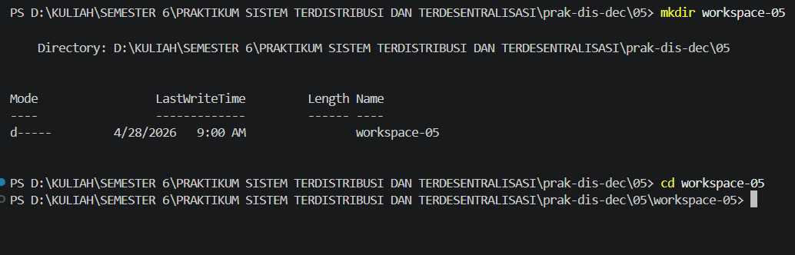
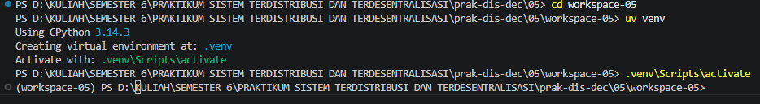
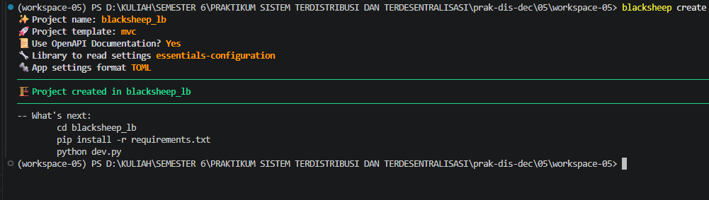
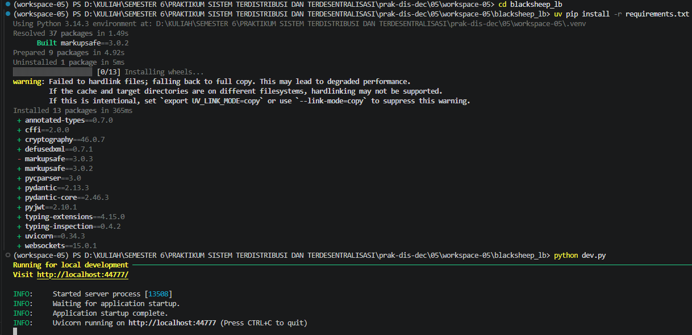
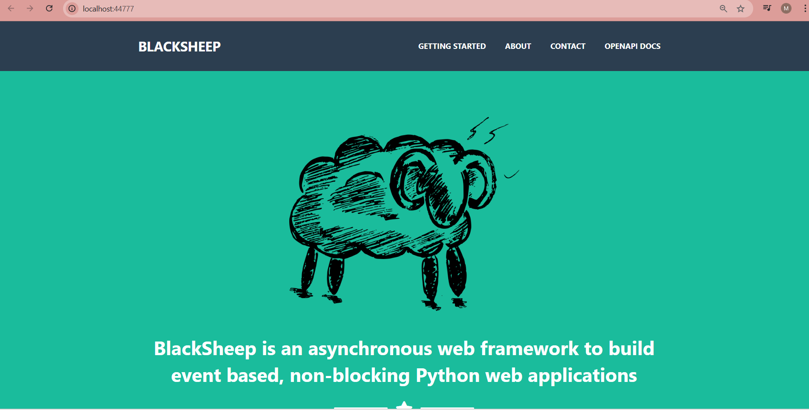

 LAPORAN PRAKTIKUM SISTEM TERDISTRIBUSI DAN TERDESENTRALISASI #

---
## Minggu 5

------
Nama    : Muhammad Java Arifin

NIM     : 235410073

-----

## Fault Tolerance

Materi ini merupakan materi Praktikum SIstem Terdistribusi dan Terdesentralisasi
untuk pembahasan tentang Fault Tolerance. Pembahasan tentang load balancing diperlukan
agar high-availability dari suatu aplikasi bisa tercapai dengan melakukan proses scaling
aplikasi menjadi lebih dari satu dan mengkonfigurasi proxy load balance

### 1.Persiapan Folder dan Python

Menginstall paket yang dibutuhkan

### 2. 
 Membuat Aplikasi Web

Masuk ke direktori dan jalankan 

### 3. Konfogurasi Nginx dan Docker Compose
