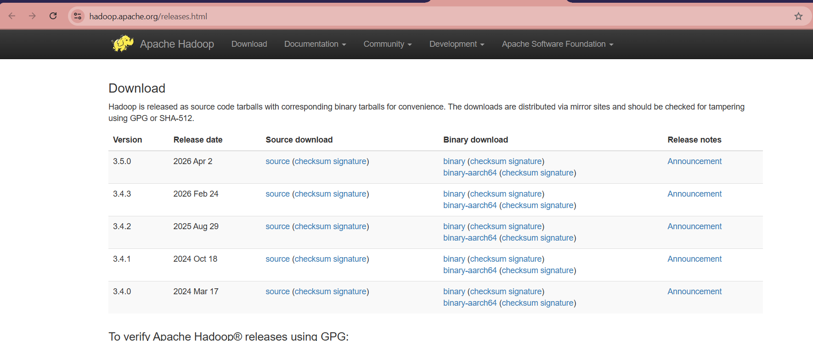
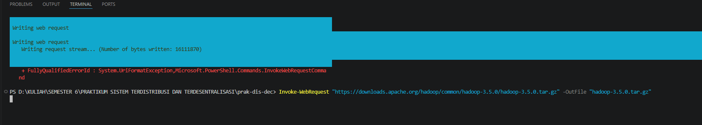

 LAPORAN PRAKTIKUM SISTEM TERDISTRIBUSI DAN TERDESENTRALISASI #

---
## Minggu 5

------
Nama    : Muhammad Java Arifin

NIM     : 235410073

-----

## Distributed File System - HDFS

### 0. Persyaratan Software

Untuk mengerjakan materi pada petunjuk ini, beberapa distribusi software diperlukan:

- JDK: versi 17 dan/atau 21. Jika akan mengkompilasi Apache Hadoop, gunakan versi 17. JDK versi 17 digunakan untuk server, sedangkan untuk client bisa menggunakan
JDK 17 atau 21.

- Apache Hadoop. Versi ini menggunakan versi 3.5.0 (rilis 2 April 2026).
- pdsh
- ssh
- sshd telah dijalankan. Pada sistem Artix Linux + dinit sebagai init system, jalankan
menggunakan sudo dinitctl start sshd. Jika menggunakan systemd: sudo
systemctl start ssh

### 1. Unduh Apache Hadoop

Ambil distribusi Apache Hadoop di https://hadoop.apache.org/releases.html

### 2. Instalasi Apache Hadoop

Ekstraksi file hasil download (asumsikan berada di
~/master/data-engineering/apache-hadoop/hadoop-3.5.0.tar.gz), setelah itu
konfigurasikan env var PATH:

    Invoke-WebRequest "https://downloads.apache.org/hadoop/common/hadoop-3.5.0/hadoop-3.5.0.tar.gz" -OutFile "hadoop-3.5.0.tar.gz"

### 3. Lanjut Ekstrak

