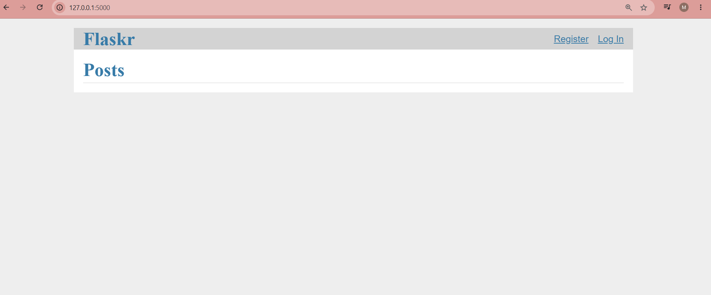
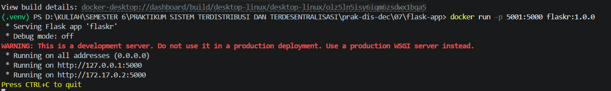
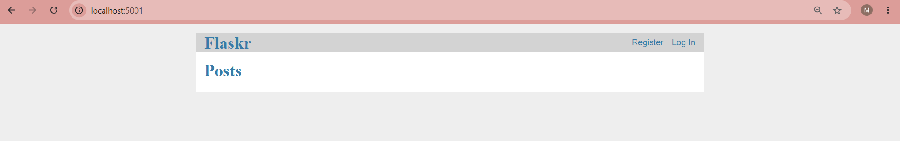

 LAPORAN PRAKTIKUM SISTEM TERDISTRIBUSI DAN TERDESENTRALISASI #

---
## Minggu 7

------
Nama    : Muhammad Java Arifin

NIM     : 235410073

-----
## Cloud Computing

### Pengantar
Cloud Computing menggunakan pendekatan XaaS atau sering juga disebut sebagai
Everything as a Service. Dengan menggunakan pendekatan ini, provider dari Cloud
Computing menyediakan berbagai sumber daya komputasi dan konsumen mendapatkan
sumber daya tersebut dalam bentuk layanan. Meskipun saat ini ada banyak XaaS tetapi
secara umum biasanya dibagi menjadi 3:

1. SaaS: Software as a Service
2. PaaS: Platform as a Service
3. IaaS: Infrastructure as a Service

### 1.Install Python 3.14 dan Persiapan Aplikasi Flask

- Install Python 3.14
    
    
- Jalankan Docker Dekstop
- Mengambil kode sumber dan membuat folder:

        # Clone repositori Flask
        git clone https://github.com/pallets/flask

        # Buat folder baru
        mkdir flask-app

        # Copy isi folder tutorial ke dalam folder flask-app
        Copy-Item -Path .\flask\examples\tutorial\* -Destination .\flask-app\ -Recurse

        # Masuk ke folder aplikasi
        cd flask-app

   
    Clone repositori Flask
    
    
    Membuat Folder
    

    Copy isi folder tutorial ke dalam folder flask-app
    

    Masuk ke folder 
    

    Aktifkan Virtual Environment
    
    

    
    

- Setup Virtual Environment dan Uji Coba Lokal:

        # Buat dan aktifkan virtual environment
        python -m venv .venv
        .venv\Scripts\activate

        # Install library yang dibutuhkan
        uv pip install -e .

        # Inisialisasi database dan jalankan aplikasi
        flask --app flaskr init-db

    Buat dan aktifkan virtual environment
    
    

    Install library yang dibutuhkan
    

    Inisialisasi database:
    

    Jalankan aplikasi
    
    

### 2. Buat Aplikasi Menjadi CA - Docker

- Membuat File Dockerfile

        FROM python:3.14
        RUN mkdir /app
        WORKDIR /app
        ADD . /app/
        RUN pip install -e .
        RUN flask --app flaskr init-db
        EXPOSE 5000
        CMD ["flask", "--app", "flaskr", "run", "--host=0.0.0.0", "--port=5000"]

    
    Membuat File Dockerfile
    

- Membangun Docker Image (Build)

        docker build -f Dockerfile -t flaskr:1.0.0 .
    

- Menjalankan Containerized App

        docker run -p 5001:5000 flaskr:1.0.0
    
    
    
    