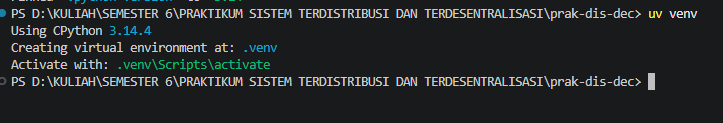
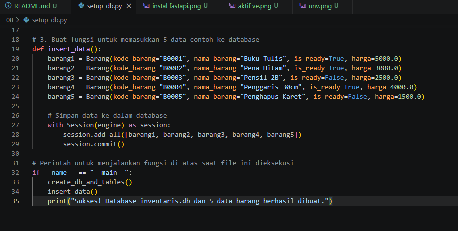
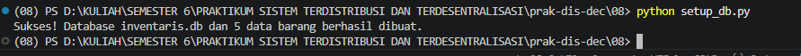
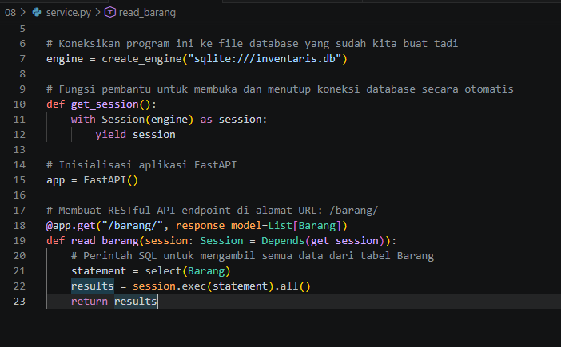
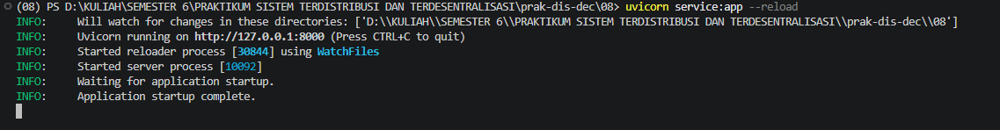
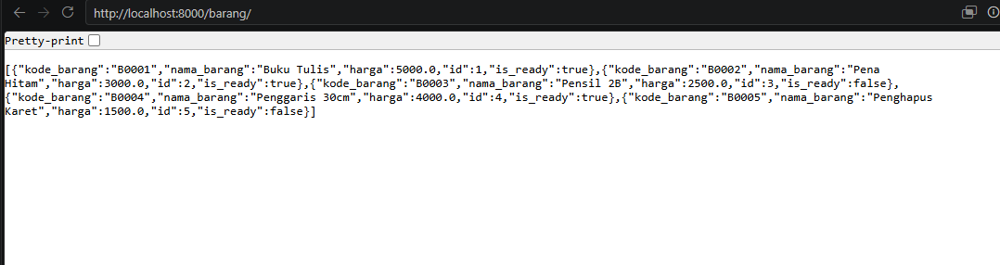

## LAPORAN PRAKTIKUM SISTEM TERDISTRIBUSI DAN TERDESENTRALISASI 

---
## Minggu 8

------
Nama    : Muhammad Java Arifin

NIM     : 235410073

-----

## Arsitektur Microservices untuk Sistem Terdistribusi

### Tugas

#### 1. Tahap 1: Persiapan Lingkungan (Environment)

* Periksa Daftar Python yang tersedia di komputer
* Buat Virtual Environment (Venv)

    

* Aktifkan Virtual Environment

    

* Instal Pustaka FastAPI dan SQLModel

    

### 2. Membuat Database & Mengisi Data (setup_db.py)

* Buat sebuah file baru di VS Code, beri nama (setup_db.py.)

    

* Jalankan kode

    

### 3. Membuat Web API Service (service.py)

* Buat file baru lagi di VS Code, beri nama (service.py.)

    

### 4. Menjalankan dan Menguji

* Nyalakan Server API

    

* Menguji

    

