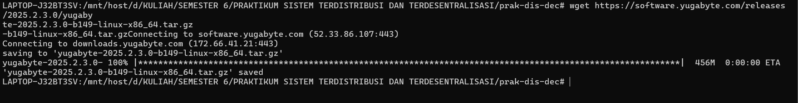
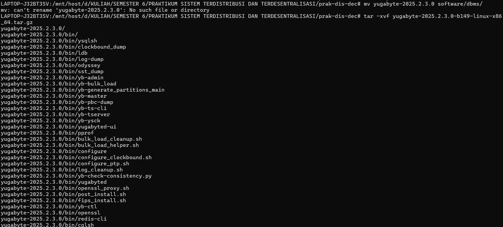
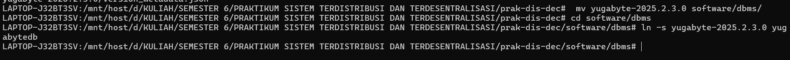
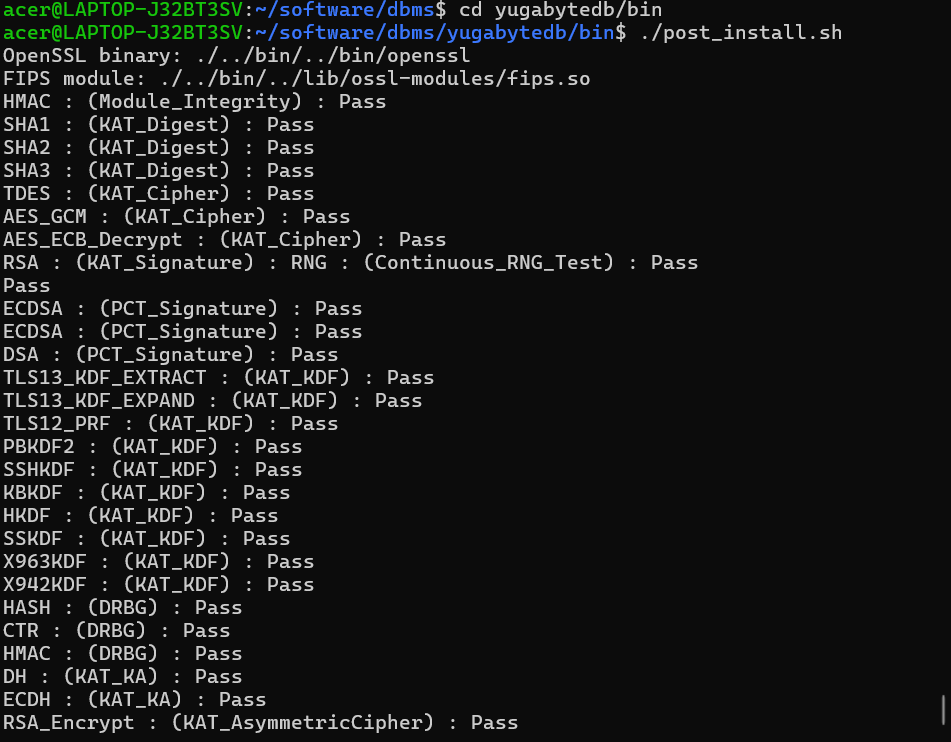
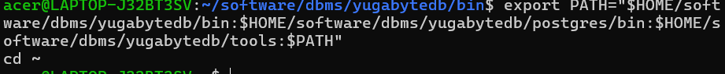
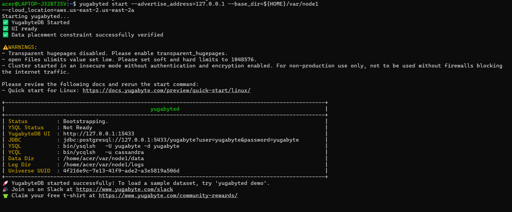
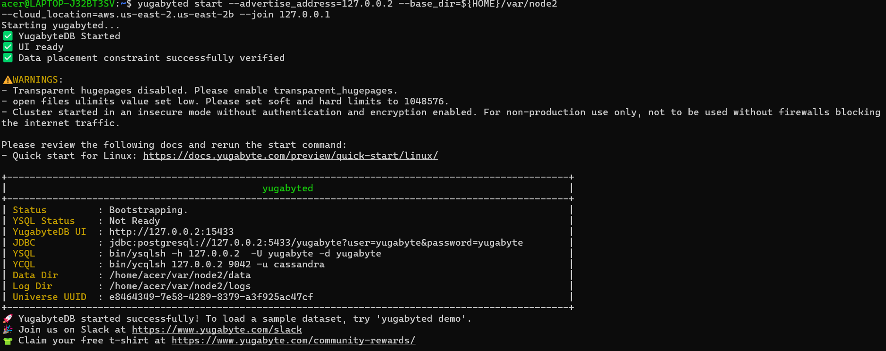
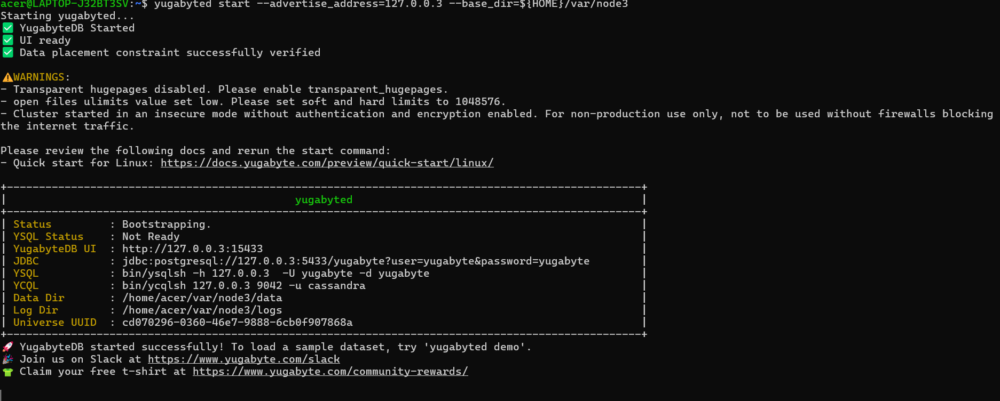

## LAPORAN PRAKTIKUM SISTEM TERDISTRIBUSI DAN TERDESENTRALISASI 

---
## Minggu 10

------
Nama    : Muhammad Java Arifin

NIM     : 235410073

-----

### Data Terdistrib

### Tugas

#### Kerjakan langkah 0-4 di atas, beri penjelasan

#### 1. Unduh dan Ekstrak YugabyteDB

    wget https://software.yugabyte.com/releases/2025.2.3.0/yugabyte-2025.2.3.0-b149-linux-x86_64.tar.gz

jalankan perintah diatas untuk mengunduh dan mengekstrak file tarball-nya

#### 2. Rapikan folder dan buat Symlink

Kita akan membuat struktur folder software/dbms agar tapi, lalu membuat symlink:

    mkdir -p software/dbms
    mv yugabyte-2025.2.3.0 software/dbms/
    cd software/dbms
    ln -s yugabyte-2025.2.3.0 yugabytedb

#### 3. Jalankan Post-Install
Masuk ke folder bin dan jalankan skrip instalasinya:

    cd yugabytedb/bin
    ./post_install.sh

#### 4. Konfigurasi Environment

Daftarkan environment variables agar perintah YugabyteDB dikenali oleh sistem Ubuntu

    export PATH="$HOME/software/dbms/yugabytedb/bin:$HOME/software/dbms/yugabytedb/postgres/bin:$HOME/software/dbms/yugabytedb/tools:$PATH"
    cd ~

#### 5. Buat Klaster 3 Node
Jalankan perintah ini satu per satu. 
Mulai Node 1 (Pusat):

    yugabyted start --advertise_address=127.0.0.1 --base_dir=${HOME}/var/node1
    --cloud_location=aws.us-east-2.us-east-2a

Mulai Node 2 (Bergabung ke Node 1):

    $ yugabyted start --advertise_address=127.0.0.2 --base_dir=${HOME}/var/node2
    --cloud_location=aws.us-east-2.us-east-2b --join 127.0.0.1

Mulai Node 3 (Bergabung ke Node 1):

    yugabyted start --advertise_address=127.0.0.3 --base_dir=${HOME}/var/node3 --cloud_location=aws.us-east-2.us-east-2c --join=127.0.0.1

Atur Data Placement (Penempatan Data):

    yugabyted configure data_placement --base_dir=${HOME}/var/node1 --fault_tolerance=zone

