## LAPORAN PRAKTIKUM SISTEM TERDISTRIBUSI DAN TERDESENTRALISASI 

---
## Minggu 11

------
Nama    : Muhammad Java Arifin

NIM     : 235410073

-----
### Sistem Terdesentralisasi, Blockchain dan Web 3.0

1. ### Cara Kerja Blockchain

    Suatu blockchain terdiri atas sekumpulan blok data yang saling terhubung dan
    dikunci menggunakan hash

    #### A. Tugas 1: Kerjakan potongan script di atas dan buatlah simpulan terkait dengan hasil proses hash.
    

    penjelasan : Intinya, proses hash itu seperti mesin penyandi pesan. Sepanjang atau sependek apa pun teks yang kita ketik, hasilnya akan selalu diubah menjadi deretan kode acak dengan panjang yang persis sama. Setiap teks pasti memiliki kodenya sendiri yang benar-benar unik, dan hebatnya lagi, sistem ini bekerja satu arah—artinya, tidak ada orang yang bisa melacak atau menebak kata aslinya hanya dengan melihat kode acak tersebut.

    #### B. Menjelaskan alur kerja source code simulasi UtdiBlockchain

    Mensimulasikan pembuatan blockchain sendiri (UtdiBlockchain) menggunakan Python.
    * File CoreBlockchain.py
    
        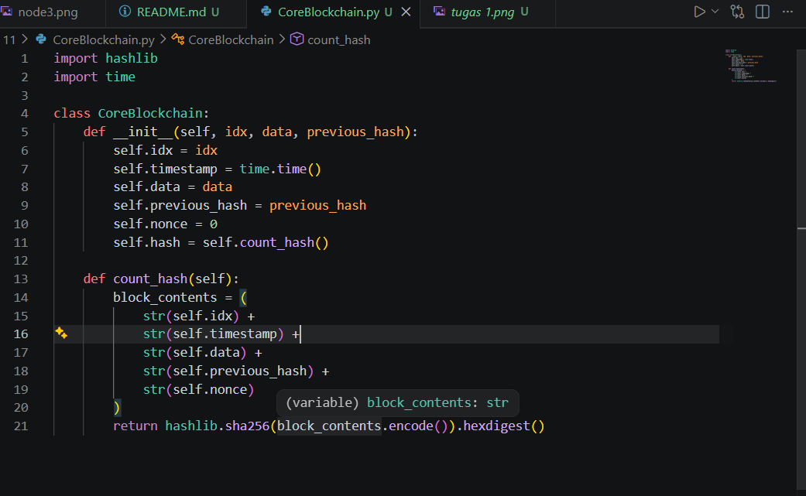

    * File UtdiBlockchain.py

        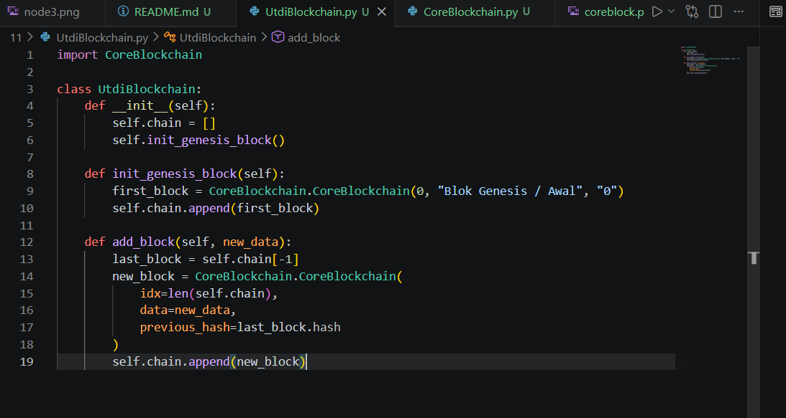
        
    * file blockchain_demo_01.py

        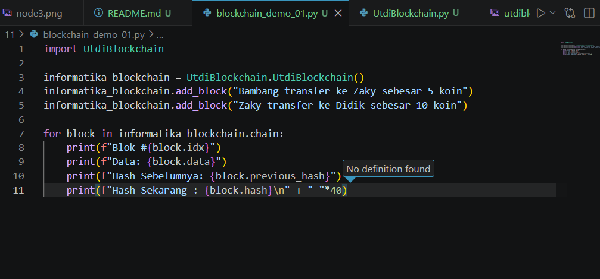

    * Menjalankan simulasi di terminal: python blockchain_demo_01.

        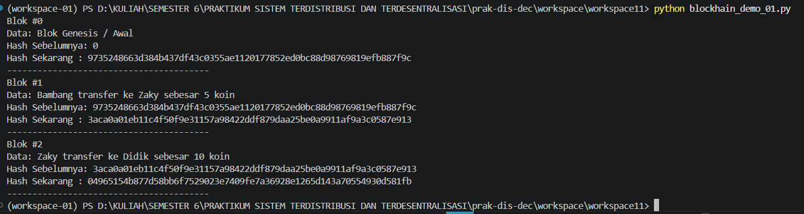

   #### Penjelasan Alur Kerja Sistem Blockchain:
   * CoreBlockchain.py:

        Berfungsi sebagai cetak biru (struktur dasar) dari sebuah blok. Setiap blok menyimpan informasi indeks, waktu (timestamp), data transaksi, angka acak pengaman (nonce), dan yang paling penting: Hash dari blok sebelumnya (previous_hash). Fungsi count_hash akan merangkai semua atribut tersebut menjadi teks panjang lalu menghitung nilai SHA-256 nya.

   * UtdiBlockchain.py

        File ini berperan sebagai sistem manajemen struktur data yang merangkai setiap blok menjadi sebuah list yang saling terhubung (chain) . Di dalamnya terdapat fungsi init_genesis_block() yang otomatis dieksekusi pertama kali untuk menciptakan "Blok 0" (Genesis Block) dengan nilai hash awal yang selalu dikonfigurasi sebagai "0" . Selanjutnya, method add_block() bertugas merangkum data transaksi baru ke dalam blok baru, sekaligus menjaga integritas rantai dengan cara mengaitkan blok baru tersebut ke nilai hash milik blok paling akhir yang ada di dalam list .

   * blockhain_demo_01.py

        Ini merupakan script utama (entry point) untuk menginisialisasi objek blockchain dan menjalankan simulasi . File ini menyisipkan dua buah data transaksi ke dalam rantai dan mencetak riwayat keseluruhan blok ke layar . Output terminal dari program ini memberikan pembuktian visual dari konsep chaining, di mana nilai "Hash Sebelumnya" pada blok baru (seperti Blok #1 dan Blok #2) terbukti 100% identik dengan "Hash Sekarang" dari blok yang mendahuluinya . Hal ini menandakan bahwa mekanisme penguncian hash berfungsi dengan baik

### 2. Pengenalan Blockchain dan Ethereum

Pada dasarnya ada beberapa tipe blockchain: public, private, dan consortium
blockchain. Public blockchain melibatkan node di seluruh dunia dan tidak ada batasan bagi
siapapun untuk bergabung ke jaringan blockchain tersebut. Private blockchain merupakan
blockchain yang digunakan di lingkungan private tertentu. Secara infrastruktur sebenarnya
sama dengan public blockchain tetapi hanya node pada jaringan lokal tertentu yang bisa
menjadi anggotanya. Consortium blockchain merupakan blockchain yang digunakan di lebih
dari satu organisasi tetapi terbatas hanya untuk anggota-anggota organisasi tersebut yang
diijinkan. Pada praktikum ini, kita akan menggunakan Ethereum sebagai public blockchain
(catatan: Ethereum juga mempunyai implementasi level private yang dikembangkan oleh tim
dari Consensys. Lihat Hyperledger Besu di https://besu.hyperledger.org/private-networks).

#### A.  Instalasi MetaMask

* Mengunjungi situs resmi metamask.io 

    

* Add ro Chrome dan setujui 

    

#### B. Setup Wallet dan Recovery Phrase

* Setelah berhasil terinstall, buka ekstensi MetaMask dan bikin dompet baru

    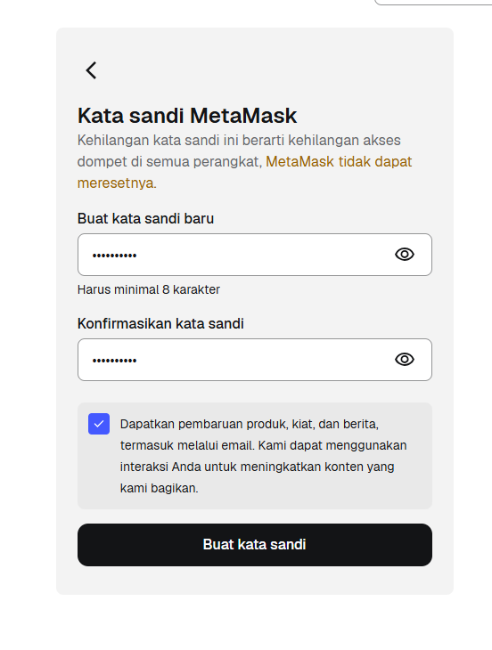
    
    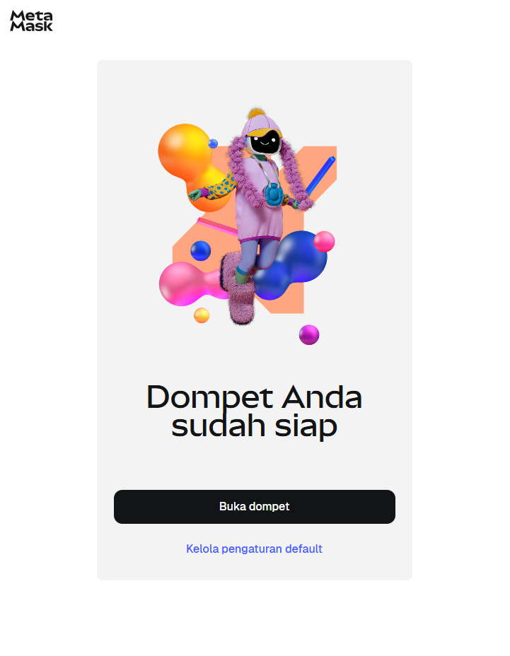

#### C. Konfigurasi Testnet (Sepolia) dan Request Token (Faucet)

*  klik opsi Networks, aktifkan tampilkan jaringan pengujian, lalu pilih Sepolia pada menu Metamask.

    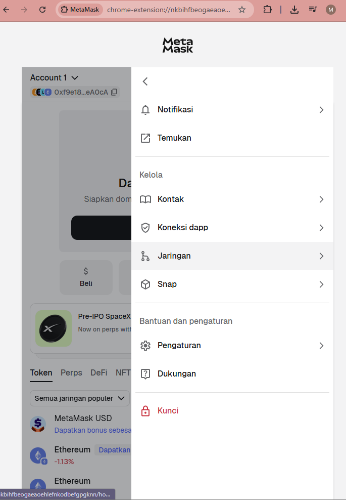

    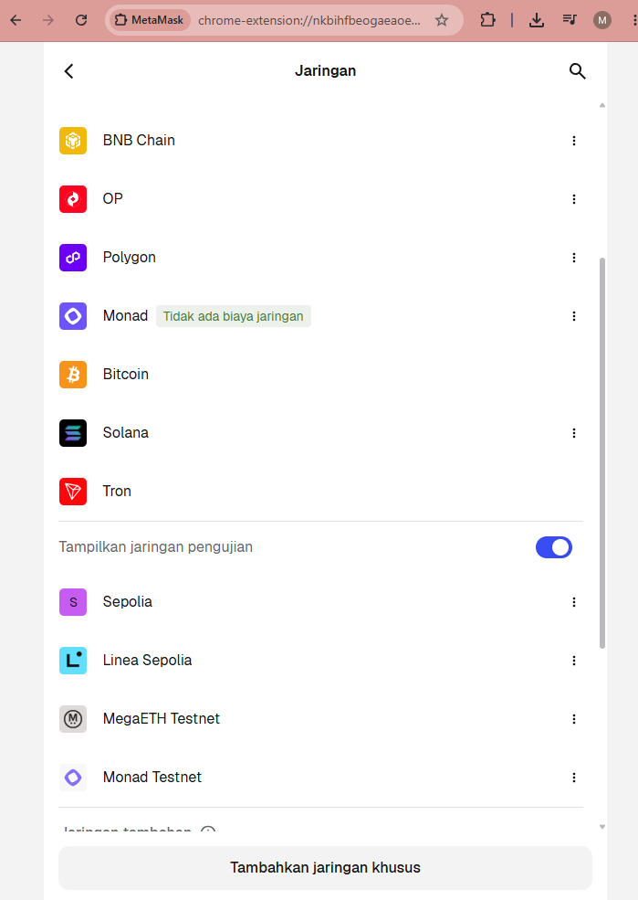

* Buka situs https://faucets.chain.link/ untuk meminta dana simulasi (ETH Testnet).

    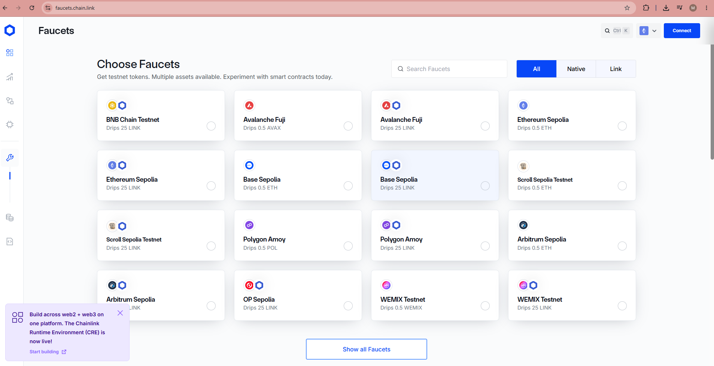

* Pilih Ethereum Sepolia, hubungkan (Connect) dengan akun MetaMask, dan konfirmasi Signature Request di aplikasi MetaMask.

    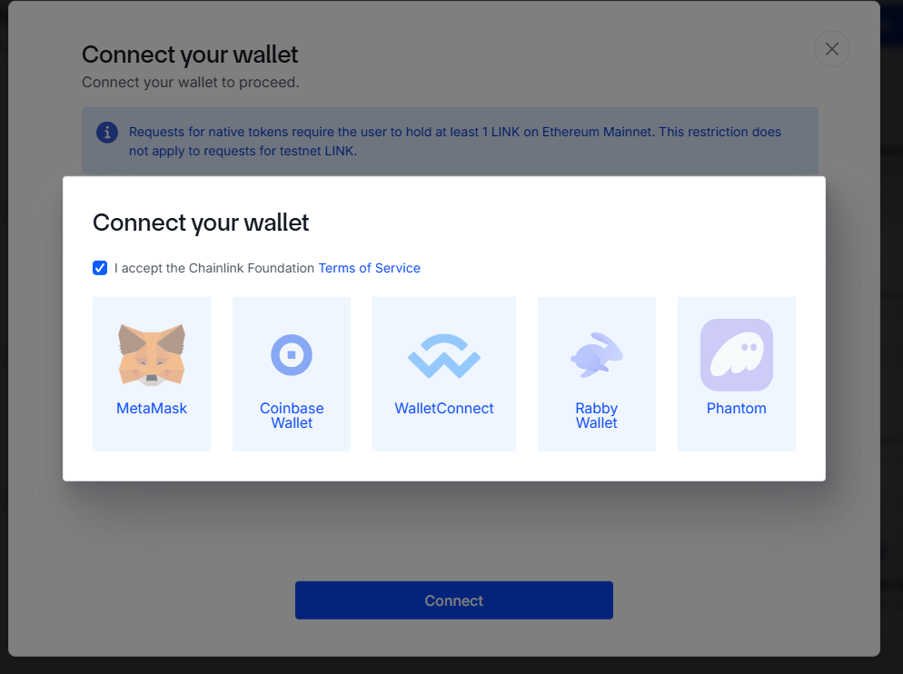

* klik get tokens

    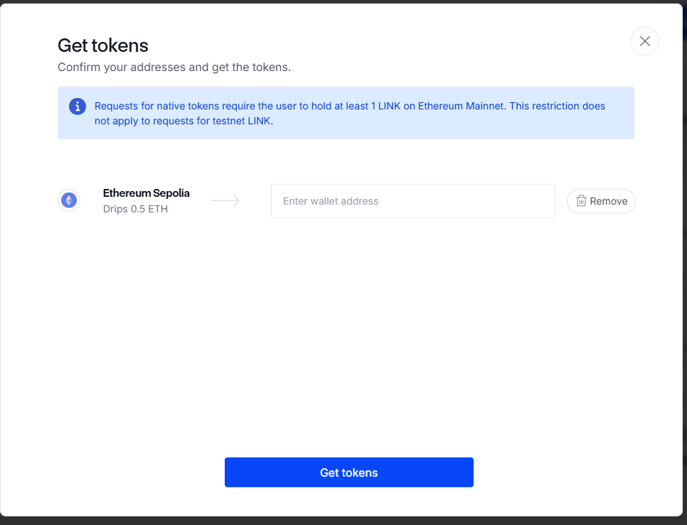

    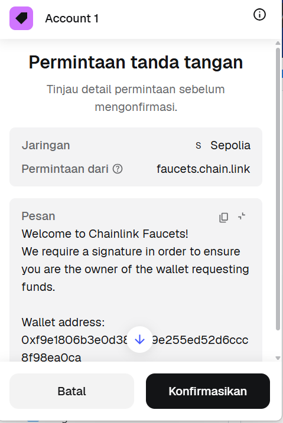

### Tugas 3 

Penjelasan  beberapa istilah berikut ini:

 * #### DApps (Decentralized Applications)

    Merupakan aplikasi digital yang beroperasi di atas jaringan peer-to-peer (seperti blockchain). Berbeda dengan aplikasi konvensional, DApps tidak dikendalikan oleh satu entitas atau server pusat tunggal, sehingga sifatnya terdesentralisasi.

* #### NFT (Non-Fungible Token)

    Aset kriptografi di dalam jaringan blockchain yang mewakili entitas berwujud atau digital dengan kode identifikasi yang sama sekali unik. Sifat non-fungible mengartikan bahwa token ini tidak bisa ditukar dengan token lain yang bernilai sama (tidak seperti uang tunai atau Bitcoin), sehingga ideal digunakan sebagai sertifikat otentikasi untuk kepemilikan karya seni atau aset digital lainnya.

 * #### DEX (Decentralized Exchange)

    Platform bursa pertukaran aset kripto yang beroperasi secara peer-to-peer (P2P). Melalui DEX, pengguna dapat melakukan aktivitas jual beli secara langsung berkat bantuan Smart Contracts, sehingga peran pihak ketiga (broker atau perantara keuangan tradisional) tidak lagi dibutuhkan.

* #### Tokenization

    Sebuah mekanisme yang mengonversi nilai, hak, atau kepemilikan dari suatu aset nyata maupun aset digital ke dalam wujud token digital. Token ini kemudian diterbitkan dan direkam secara transparan di dalam sistem blockchain.

 * #### Stablecoins

    Jenis mata uang kripto yang nilainya sengaja dipatok (pegged) ke aset cadangan fisik yang nilainya jauh lebih stabil, contohnya Dolar AS, Euro, ataupun emas. Pembuatan stablecoins bertujuan untuk meredam volatilitas (fluktuasi harga yang ekstrem) yang umumnya terjadi di pasar kripto standar.

#### 2. Peranti Pengembangan DApps di Ethereum

Untuk membangun DApps di jaringan Ethereum, pendekatan yang paling efisien adalah menggunakan kombinasi dua peranti sesuai dengan tahapan pengembangannya, yaitu Remix IDE dan Hardhat.

Tahap Awal & Prototyping: Menggunakan Remix IDE
Remix IDE merupakan pilihan terbaik untuk fase eksplorasi. Keuntungan utamanya adalah formatnya yang berbasis web browser, sehingga tidak menuntut proses instalasi environment yang rumit di perangkat lokal. Melalui platform ini, penulisan, pengujian, hingga tahap deploy Smart Contract (dengan bahasa Solidity) bisa dilakukan dengan sangat cepat. Sistemnya juga sudah terhubung secara mulus dengan dompet MetaMask, yang memudahkan proses pengujian deploy langsung ke testnet seperti Sepolia.

Tahap Pengembangan Skala Penuh: Menggunakan Hardhat
Ketika kompleksitas proyek mulai meningkat—terutama saat perlu disambungkan dengan antarmuka frontend (seperti React/Next.js) dan membutuhkan skenario testing yang komprehensif—maka framework berbasis Node.js seperti Hardhat adalah peranti yang wajib digunakan.

* Hardhat menyediakan local Ethereum network (Hardhat Network) yang mengizinkan proses simulasi secara offline di komputer pribadi tanpa batasan.

* Menawarkan fitur debugging yang luar biasa membantu, seperti kemampuan menjalankan console.log() langsung dari dalam baris kode Solidity.

### Kesimpulan

Pelaksanaan Praktikum Modul 11 ini membekali kita dengan wawasan fundamental yang esensial mengenai ekosistem Web 3.0. Lewat praktik simulasi berbasis Python, terlihat jelas bagaimana algoritma hash (SHA-256) berperan vital sebagai tulang punggung yang mengaitkan antarblok, menjamin integritas, serta memastikan data kebal terhadap upaya manipulasi di masa depan (immutability). Selain itu, eksplorasi jaringan Ethereum menggunakan wallet MetaMask dan jaringan uji (testnet) Sepolia menghadirkan pengalaman langsung yang sangat aplikatif. Sesi ini mengilustrasikan cara para developer bereksperimen, merancang Smart Contracts, serta mengelola aset kripto di lingkungan yang sepenuhnya aman tanpa perlu mempertaruhkan nilai finansial sungguhan.