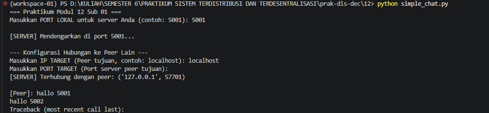
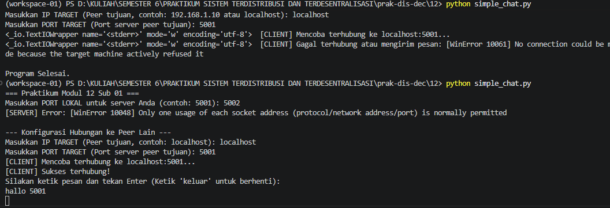
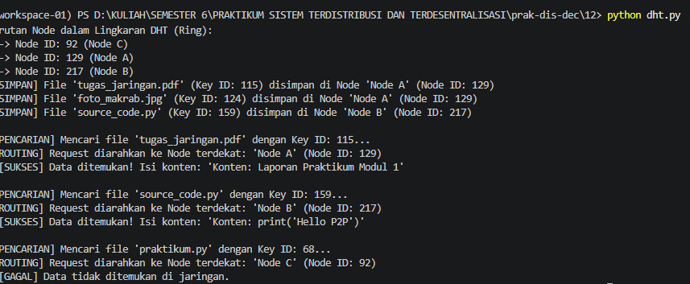
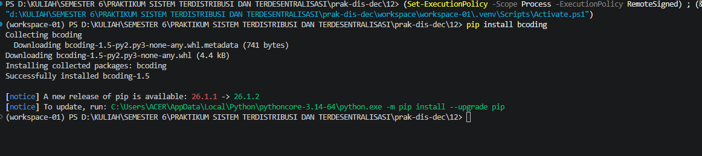
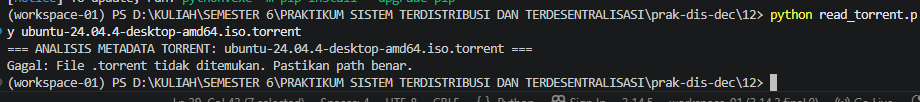

## LAPORAN PRAKTIKUM SISTEM TERDISTRIBUSI DAN TERDESENTRALISASI 

---
## Minggu 12

------
Nama    : Muhammad Java Arifin

NIM     : 235410073

-----

### Teknologi P2P (Peer-to-Peer)

Praktikum ini bertujuan untuk mengeksplorasi teknologi P2P yang terdiri atas sekumpulan nodes yang terhubung secara langsung tanpa adanya suatu server yang menjadi perantara. Dalam topologi ini, sebuah node bisa berfungsi sebagai client sekaligus berfungsi sebagai server. Beberapa studi kasus yang dibahas mencakup aplikasi chat sederhana, simulasi Distributed Hash Table (DHT), dan analisis metadata file Torrent.

#### 1. Koneksi Antar Nodes (Simple Chat)

Bagian pertama dari praktikum ini mengeksplorasi cara komunikasi dua perangkat (nodes) di jaringan P2P menggunakan network socket TCP dan multithreading pada Python. Dengan mempelajari program ini, bisa diketahui bagaimana cara koneksi antar nodes dilakukan serta bagaimana cara mengirimkan message.

#### A. Pembuatan Source Code

Silakan buat file baru bernama simple_chat.py

    	
    import socket
    import threading
    import sys
    import time

    def terima_pesan(port_saya):
        server_socket = socket.socket(socket.AF_INET, socket.SOCK_STREAM)
        try:
            # Mengikat socket ke port lokal
            server_socket.bind(('0.0.0.0', port_saya))
            server_socket.listen(1)
            print(sys.stderr, f"\n[SERVER] Mendengarkan di port {port_saya}...")
            
            koneksi, alamat_peer = server_socket.accept()
            print(sys.stderr, f"\n[SERVER] Terhubung dengan peer: {alamat_peer}")
            
            while True:
                data = koneksi.recv(1024)
                if not data:
                    print(sys.stderr, "\n[SERVER] Peer memutuskan koneksi.")
                    break
                print(f"\n[Peer]: {data.decode('utf-8')}")
        except Exception as e:
            print(sys.stderr, f" [SERVER] Error: {e}")
        finally:
            server_socket.close()

    def kirim_pesan(ip_tujuan, port_tujuan):
        client_socket = socket.socket(socket.AF_INET, socket.SOCK_STREAM)
        print(sys.stderr, f" [CLIENT] Mencoba terhubung ke {ip_tujuan}:{port_tujuan}...")
        try:
            client_socket.connect((ip_tujuan, port_tujuan))
            print(sys.stderr, "[CLIENT] Sukses terhubung!")
            print("Silakan ketik pesan dan tekan Enter (Ketik 'keluar' untuk berhenti):")
            while True:
                pesan = input()
                if pesan.lower() == 'keluar':
                    break
                client_socket.sendall(pesan.encode('utf-8'))
        except Exception as e:
            print(sys.stderr, f" [CLIENT] Gagal terhubung atau mengirim pesan: {e}")
        finally:
            client_socket.close()

    if __name__ == "__main__":
        print("=== Praktikum Modul 12 Sub 01 ===")
        port_lokal = int(input("Masukkan PORT LOKAL untuk server Anda (contoh: 5001): "))
        
        # Threading untuk mendengarkan pesan masuk
        thread_server = threading.Thread(target=terima_pesan, args=(port_lokal,))
        thread_server.daemon = True
        thread_server.start()
        
        time.sleep(1)
        print("\n--- Konfigurasi Hubungan ke Peer Lain ---")
        ip_target = input("Masukkan IP TARGET (Peer tujuan, contoh: 192.168.1.10 atau localhost): ")
        port_target = int(input("Masukkan PORT TARGET (Port server peer tujuan): "))
        
        # Menjalankan fungsi pengiriman pesan
        kirim_pesan(ip_target, port_target)
        print("\nProgram Selesai.")
    
#### B. Eksekusi Program 

Langkah Eksekusi:

* Di Terminal 1, jalankan python simple_chat.py. Masukkan port lokal (misalnya 5001).

    

* Di Terminal 2, jalankan python simple_chat.py. Masukkan port lokal (misalnya 5002).

    

Penjelasan :
* Membuka Port (Menerima dan Mengirim):

    Proses ini berada di dalam fungsi terima_pesan. Kode server_socket.bind(('0.0.0.0', port_saya)) bertugas mengikat program ke antarmuka jaringan dengan port yang kita tentukan. Selanjutnya, perintah server_socket.listen(1) mengaktifkan mode pendengar, membuat node siap menerima satu koneksi masuk dari peer lain

* Menerima Pesan:

    Setelah ada peer yang terhubung melalui server_socket.accept(), program akan memasuki perulangan untuk terus mendengarkan data. Perintah data = koneksi.recv(1024) digunakan untuk menangkap aliran byte yang masuk dengan batas ukuran tertentu. Data byte tersebut kemudian diterjemahkan kembali menjadi teks yang dapat dibaca menggunakan perintah data.decode('utf-8').

* Mengirim Pesan:

    Sistem pengiriman dikelola dalam fungsi kirim_pesan. Pesan teks yang diketik oleh pengguna ditangkap, kemudian diubah ke dalam bentuk paket byte menggunakan metode pesan.encode('utf-8'). Paket tersebut lalu didorong melewati jaringan langsung menuju peer sasaran menggunakan perintah client_socket.sendall()

#### 2. DHT (Distributed Hash Table)

DHT merupakan mekanisme yang biasanya digunakan oleh teknologi P2P untuk pencarian data tanpa adanya server yang menyimpan semua data

#### A. Pembuatan Source Code
Buat file bernama dht.py

    import hashlib

    def hitung_hash_8bit(teks):
        sha1 = hashlib.sha1(teks.encode('utf-8')).hexdigest()
        return int(sha1[-2:], 16)

    class NodeP2P:
        def __init__(self, nama_node):
            self.nama = nama_node
            self.id = hitung_hash_8bit(nama_node)
            self.penyimpanan_lokal = {}
            print(f"Node '{self.nama}' berhasil dibuat dengan ID: {self.id}")

    class LingkaranDHT:
        def __init__(self):
            self.daftar_node = []

        def tambah_node(self, node):
            self.daftar_node.append(node)
            self.daftar_node.sort(key=lambda x: x.id)

        def cari_node_terdekat(self, key_data):
            for node in self.daftar_node:
                if node.id >= key_data:
                    return node
            return self.daftar_node[0]

        def simpan_data(self, nama_file, isi_konten):
            key_data = hitung_hash_8bit(nama_file)
            node_target = self.cari_node_terdekat(key_data)
            node_target.penyimpanan_lokal[key_data] = (nama_file, isi_konten)
            print(f"[SIMPAN] File '{nama_file}' (Key ID: {key_data}) disimpan di Node '{node_target.nama}' (Node ID: {node_target.id})")

        def cari_data(self, nama_file):
            key_data = hitung_hash_8bit(nama_file)
            node_target = self.cari_node_terdekat(key_data)
            print(f"\n[PENCARIAN] Mencari file '{nama_file}' dengan Key ID: {key_data}...")
            print(f"[ROUTING] Request diarahkan ke Node terdekat: '{node_target.nama}' (Node ID: {node_target.id})")
            
            if key_data in node_target.penyimpanan_lokal:
                nama, konten = node_target.penyimpanan_lokal[key_data]
                print(f" [SUKSES] Data ditemukan! Isi konten: '{konten}'")
            else:
                print(" [GAGAL] Data tidak ditemukan di jaringan.")

    if __name__ == "__main__":
        print("=== Praktikum Modul 12 Teknologi P2P Simulasi DHT ===")
        dht = LingkaranDHT()
        node_a = NodeP2P("Node A")
        node_b = NodeP2P("Node B")
        node_c = NodeP2P("Node C")
        
        dht.tambah_node(node_a)
        dht.tambah_node(node_b)
        dht.tambah_node(node_c)
        
        print("\nUrutan Node dalam Lingkaran DHT (Ring):")
        for n in dht.daftar_node:
            print(f" -> Node ID: {n.id} ({n.nama})")
            
        dht.simpan_data("tugas_jaringan.pdf", "Konten: Laporan Praktikum Modul 1")
        dht.simpan_data("foto_makrab.jpg", "Konten: Data biner gambar makrab angkatan")
        dht.simpan_data("source_code.py", "Konten: print('Hello P2P')")
        
        dht.cari_data("tugas_jaringan.pdf")
        dht.cari_data("source_code.py")
        dht.cari_data("praktikum.py")

#### B. Eksekusi

Jalankan perintah python dht.py

Penjelasan Program:
Kode di atas membangun sebuah simulasi arsitektur penyimpanan dan penemuan rute data bernama Consistent Hashing. Program menghitung identitas hash 8-bit untuk setiap node aktif. Selanjutnya, file yang ingin didistribusikan ke jaringan dihitung pula hash-nya menjadi Key ID. Penyimpanan file dikirimkan secara langsung ke sebuah target node yang secara urutan ID nilainya berdekatan dengan Key ID file tersebut

#### C. Dari program tersebut, jelaskan bagaimana DHT bisa digunakan untuk proses pencarian data yang berada pada node lainnya. Buat algoritmanya.

Berikut adalah susunan logis (pseudocode/algorithm) dari fungsi pencarian data pada jaringan berdasarkan skrip dht.py

1. Kalkulasi Key ID dari file yang dicari dengan fungsi SHA-1 (potong 8-bit).

2. Lakukan iterasi berurutan pada sekumpulan data node yang sebelumnya telah diurutkan nilai ID-nya.

3. Cari node pertama yang memenuhi syarat komparasi: ID node >= Key ID data

4. Jika ada node yang memenuhi, maka proses iterasi dihentikan, jadikan node tersebut target pencarian. Namun jika iterasi sampai akhir dan tidak menemukan kecocokan, maka arahkan rute pencarian agar kembali ke nilai node terkecil paling awal (indeks 0) untuk mengimitasi skema melingkar (wrap-around ring)

5. Periksa keberadaan key_data pada kamus data (penyimpanan lokal) node target.

6. Bila nilai ditemukan, muat output isi datanya. Bila gagal, laporkan kekosongan.  

#### 3. Torrent

Teknologi Torrent adalah sistem P2P yang lazimnya difungsikan pengguna untuk mendistribusikan dokumen berukuran raksasa dengan sangat efisien tanpa perantara server pusat.

#### A. Pembuatan Source Code yang Fleksibel

Untuk membuat script penganalisis metadata torrent menjadi lebih adaptif (memproses argumen file langsung dari terminal seperti instruksi Modul halaman 10), ubah file read_torrent.py menjadi seperti ini (pastikan pip install bcoding sudah dilakukan):

    import bcoding
    import hashlib
    import sys

    def baca_metadata_torrent(path_file_torrent):
        print(f"=== ANALISIS METADATA TORRENT: {path_file_torrent} ===")
        try:
            with open(path_file_torrent, 'rb') as f:
                data_torrent = bcoding.bdecode(f)
                
            print(f" [TRACKER URL]: {data_torrent.get('announce')}")
            
            info = data_torrent.get('info')
            if info:
                print(f" [NAMA FILE]  : {info.get('name')}")
                print(f" [UKURAN FILE]: {info.get('length')} bytes")
                print(f" [UKURAN PIECE]: {info.get('piece length')} bytes")
                
                info_bencoded = bcoding.bencode(info)
                info_hash = hashlib.sha1(info_bencoded).hexdigest()
                print(f" [INFO HASH]  : {info_hash}")
                
                jumlah_pieces = len(info.get('pieces')) // 20
                print(f" [TOTAL PIECES]: {jumlah_pieces} potongan")
                
        except FileNotFoundError:
            print("Gagal: File .torrent tidak ditemukan. Pastikan path benar.")
        except Exception as e:
            print(f"Error saat membaca torrent: {e}")

    if __name__ == "__main__":
        if len(sys.argv) < 2:
            print("Format penggunaan: python read_torrent.py namafile.torrent")
        else:
            file_target = sys.argv[1]
            baca_metadata_torrent(file_target)

### B. Pengujian 
1. Download file ISO berekstensi .torrent dari repositori sistem operasi (contoh: Ubuntu Linux atau FreeBSD dari fosstorrents.com).
https://ubuntu.com/download/alternative-downloads

2. Buka terminal pada direktori yang sama dengan letak penyimpanan file Python dan .torrent tersebut dan Jalankan perintah:

        python read_torrent.py ubuntu-24.04.4-desktop-amd64.iso.torrent

    

### C. Analisis

File .torrent pada dasarnya berfungsi menyimpan rekam jejak biner atau metadata berkas di dalam sistem P2P. Program bisa menghasilkan output yang runut karena ia memanfaatkan perpustakaan library Python untuk menerjemahkan (decode) format standar Bencode ke format struktur dictionary.

* [TRACKER URL]: Skrip secara otomatis menargetkan key bernama 'announce'. Komponen URL ini bertugas menyampaikan lokasi server tracker sebagai pemandu (publisher) bagi klien kita untuk mengenali peer lain.  

* [INFO HASH]: Sidik jari file ini diproduksi dengan mengisolasi spesifik kamus 'info', lalu meng-kompresinya ulang menggunakan .bencode(info) dan dihitung nilai keamanan heksadesimalnya dengan algoritma SHA-1. Kunci ini berguna sebagai validasi pertukaran blok data Torrent.

* [TOTAL PIECES]: Tercipta dengan membagi total jumlah panjang string dari kumpulan enkripsi hash bagian file dengan parameter mutlak 20 (bytes). Angka pembagian ini dipilih karena merupakan standar panjang output hash SHA-1 per satuan potongan file.

#### Kesimpulan

Praktikum Modul 12 berhasil memperdalam konsep teknis serta fleksibilitas fungsionalitas arsitektur Teknologi P2P (Peer-to-Peer). Dari eksperimen implementasi modul komunikasi dua arah (aplikasi chat), dapat disimpulkan bahwa arsitektur peladen pusat (centralized server) bukanlah sebuah keharusan apabila sistem dikembangkan menggunakan metode network socket TCP dua arah. Kemudian, pembedahan logika algoritma Distributed Hash Table (DHT) menunjukkan bahwa distribusi file di lautan jaringan berskala luas dapat dilakukan secara terstruktur menggunakan topologi memutar berdasarkan identitas nilai numerik hash. Rangkaian uji coba ini lantas dilengkapi dengan analisis arsitektur berkas metadata Torrent, yang menguraikan pendekatan kompresi Bencode dalam memetakan ratusan ribu pecahan file menjadi data hash validator agar file besar dapat dihantarkan antar nodes dengan integritas data yang terjamin akurat.