## LAPORAN PRAKTIKUM SISTEM TERDISTRIBUSI DAN TERDESENTRALISASI

### NAMA    : Muhammad Java Arifin

### NIM     : 235410073

### Konsensus pada Blockchain (Solana)

Praktikum ini bertujuan untuk mengeksplorasi dan mengimplementasikan jaringan blockchain menggunakan platform Solana. Solana merupakan platform blockchain yang dirancang khusus untuk mengatasi masalah skalabilitas tanpa mengorbankan keamanan atau desentralisasi. Berbeda dengan blockchain tradisional, Solana mampu memproses hingga puluhan ribu transaksi per detik (TPS) dengan biaya yang sangat murah. Keunggulan ini membuatnya ideal untuk aplikasi terdesentralisasi (dApps), decentralized finance (DeFi), dan pasar NFT

### 1. Instalasi dan Persiapan Lingkungan Pengembangan

Bagian pertama dari praktikum ini adalah melakukan instalasi perangkat lunak yang dibutuhkan untuk pengembangan aplikasi di jaringan Solana.

* Rust

    

* Node.js

    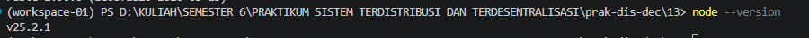

### A. Instalasi Solana CLI 

Solana CLI diinstal dan dikonfigurasi ke dalam variabel environment PATH. Selain itu, praktikum ini juga menggunakan Anchor, yaitu sebuah framework untuk DApp berbasis Solana. Instalasi Anchor dilakukan menggunakan avm (Anchor Version Manager).

Untuk mulai menggunakan Solana, kita akan melakukan instalasi software Solana, khususnya
yang digunakan untuk pengembangan aplikasi. Beberapa prasyarat yang harus diinstall terlebih
dahulu adalah:

* Install solana

    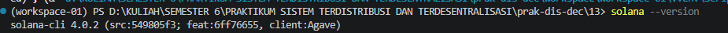

Daftarkan path Solana CLI secara permanen ke profil shell WSL Anda:

### B. Instalasi Anchor Version Manager (AVM)

#### 1. Unduh dan pasang AVM menggunakan skrip resmi:

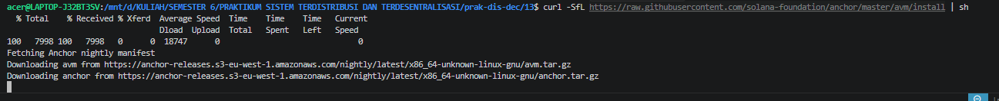

#### 2. Daftarkan letak binari AVM ke dalam environmen

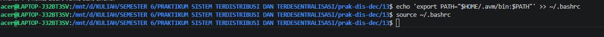

#### 3.Unduh dan gunakan framework Anchor versi terbaru melalui AVM:
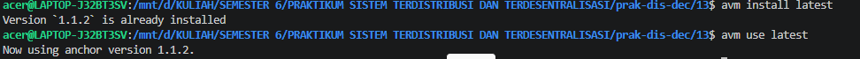

#### 4. erifikasi instalasi Anchor:

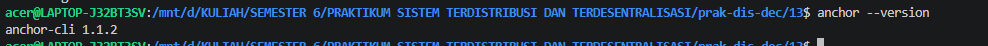

### 2. Pembuatan Alamat Wallet Solana

Wallet 1 (Akan digunakan sebagai Default Wallet)
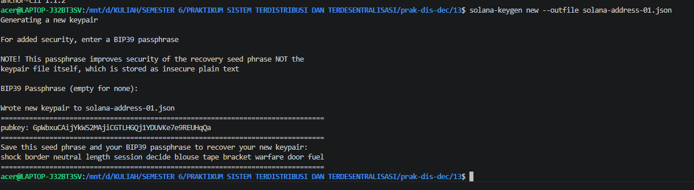

Wallet 2 (Alamat Tujuan Uji Coba)
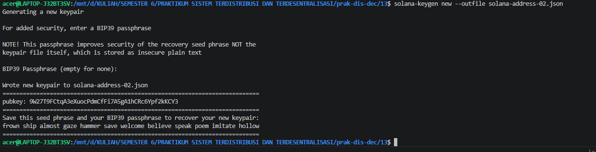

Konfigurasi Default Keypair
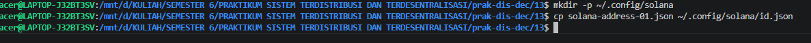

### 3. Konfigurasi Jaringan & Klaim SOL (Devnet)
Hubungkan ke Jaringan Devnet Solana
Ubah target RPC cluster Solana dari lokal/mainnet menuju kluster uji coba (Devnet):
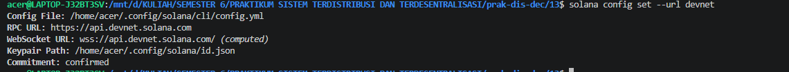

Meminta Airdrop SOL Uji Coba
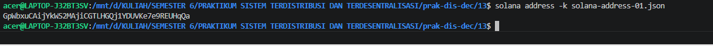

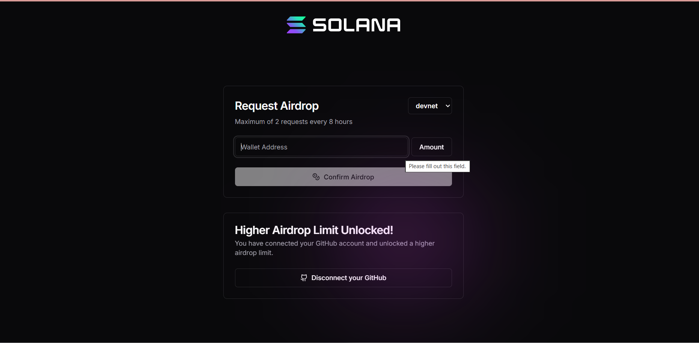

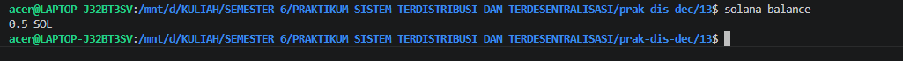

### 4. Alur Pengujian Konsensus & Transaksi

Langkah 1: Transfer Antar Wallet

Kirimkan sejumlah 0.5 SOL dari dompet default menuju dompet kedua. Gunakan flag --allow-unfunded-recipient karena akun tujuan belum memiliki saldo awal:

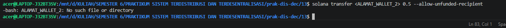

Langkah 2: Eksplorasi Detail Blok & Validator Jaringan
Guna mempelajari gabungan mekanisme Proof of History (PoH) dan Proof of Stake (PoS) pada Solana, jalankan perintah eksaminasi data berikut:

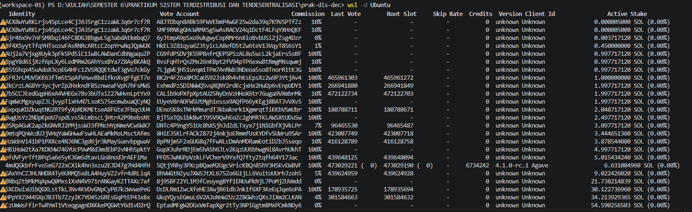
